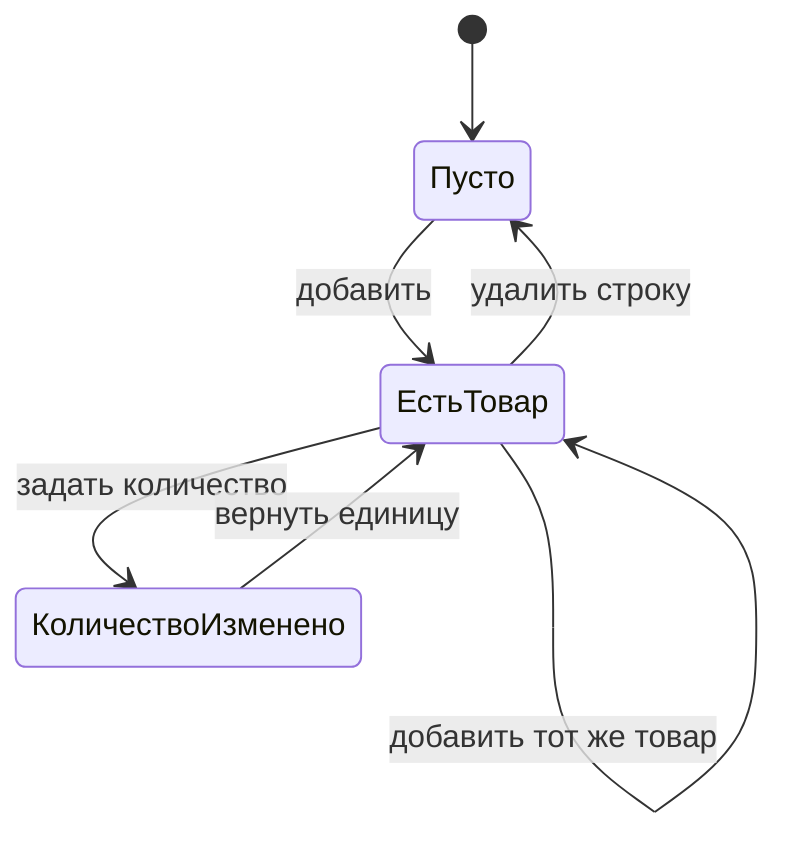

# Тест-дизайн: витрина и оформление заказа Toolshop

- **Объект тестирования:** веб-интерфейс магазина Toolshop
- **Стенд:** https://practicesoftwaretesting.com, API https://api.practicesoftwaretesting.com
- **Автор:** Гавриков Т. М.
- **Дата:** 25.08.2026

Документ объясняет, откуда взялся каждый набор данных. Тест-кейсы перечислены
в [test-cases.md](test-cases.md), найденные дефекты — в [bug-report.md](bug-report.md).

## Что проверяется через интерфейс, а что мимо него

Интерфейс — не единственный способ добраться до поведения, и гонять через
браузер всё подряд бессмысленно. Граница проведена так:

| Через браузер | Через API |
|---|---|
| Что видит и делает пользователь: сообщения об ошибках, состояние кнопок, порядок выдачи, содержимое корзины | Правила, живущие на сервере: предельные длины полей, доступ без авторизации |
| Подготовка состояния — только когда она сама и есть объект проверки | Подготовка состояния: завести пользователя, найти товар |

Восемь граничных значений длины полей через форму заняли бы полторы минуты и
зависели бы от отрисовки. Через API те же восемь проверок отвечают за две
секунды и проверяют ровно то правило, которое хотели проверить. При этом
доставку сообщения до пользователя API не покажет, поэтому она проверяется
в браузере отдельно.

## Классы эквивалентности

Внутри класса поведение формы одинаково, поэтому берётся по одному
представителю.

### Адрес электронной почты

| Класс | Представитель | Ожидание |
|---|---|---|
| корректный | `user@example.com` | принимается |
| без разделителя | `user.example.com` | отклоняется |
| без домена | `user@` | отклоняется |
| без имени | `@example.com` | отклоняется |
| с пробелом внутри | `us er@example.com` | отклоняется |
| с двумя разделителями | `user@@example.com` | отклоняется |

Автотест: `RegistrationValidationTest.invalidEmailIsRejected`.

### Пароль

| Класс | Представитель | Ожидание |
|---|---|---|
| пустой | `` | отклоняется |
| короче минимума | 1, 5, 7 символов | отклоняется |
| допустимой длины | 8 символов и больше | принимается |
| из базы утечек | `Password123` | отклоняется |

Последний класс нигде не описан и найден опытным путём: API отвечает
«The given password has appeared in a data leak». Из-за него тестовые пароли
собираются случайными — предсказуемая строка нужной длины прогон не пройдёт.

## Граничные значения

Пределы взяты из схемы `UserRequest` в OpenAPI магазина и перепроверены
запросами. Проверяется значение на границе и на шаг за ней.

| Поле | Предел | На границе | За границей |
|---|---|---|---|
| `first_name` | 40 | 40 → принимается | 41 → отклоняется |
| `last_name` | 20 | 20 → принимается | 21 → отклоняется |
| `phone` | 24 | 24 → принимается | 25 → отклоняется |
| `password` | минимум 8 | 8 → принимается | 7 → отклоняется |

Автотесты: `RegistrationBoundaryTest`.

Расхождение пределов `first_name` и `last_name` вдвое выглядит случайным, но
это поведение стенда, а не дефект: обе границы держатся ровно там, где
объявлены. А вот сообщение о минимальной длине пароля называет шесть символов
вместо восьми — это [BUG-1](bug-report.md#BUG-1).

## Попарное покрытие фильтров каталога

Четыре независимых параметра:

| Параметр | Значения |
|---|---|
| категория | Hammer, Pliers, Drill |
| бренд | ForgeFlex Tools, MightyCraft Hardware |
| сортировка | по цене вверх, по цене вниз |
| только экологичные | да, нет |

Полный перебор — 3 × 2 × 2 × 2 = **24 сочетания**. Попарное покрытие
сокращает набор до **6** и сохраняет все пары значений: каждое значение
каждого параметра встречается рядом с каждым значением каждого другого.

| № | Категория | Бренд | Сортировка | Экологичные |
|---|---|---|---|---|
| 1 | Hammer | ForgeFlex Tools | вверх | да |
| 2 | Hammer | MightyCraft Hardware | вниз | нет |
| 3 | Pliers | ForgeFlex Tools | вниз | да |
| 4 | Pliers | MightyCraft Hardware | вверх | нет |
| 5 | Drill | ForgeFlex Tools | вверх | нет |
| 6 | Drill | MightyCraft Hardware | вниз | да |

Основание для сокращения: дефекты фильтрации проявляются на взаимодействии
двух условий, а не четырёх сразу. Набор строится в коде классом `Pairwise`, а
не переписан сюда руками, поэтому таблица и прогон не могут разойтись.

Проверяется **порядок выдачи, а не её состав**. Состав зависит от данных
стенда, а товары на нём заводятся кем угодно без авторизации
([BUG-5](bug-report.md#BUG-5)), так что ожидать конкретные названия нельзя.
Порядок же обязан держаться при любом сочетании фильтров.

Автотест: `CatalogFilterTest.sortingHoldsUnderAnyFilterCombination`.

## Таблица решений: подтверждение заказа

Условия — выбран ли способ оплаты и заполнены ли его поля. Действие —
доступна ли кнопка подтверждения.

| Способ выбран | Поля способа | Заполнены | Кнопка |
|---|---|---|---|
| нет | — | — | заблокирована |
| да | есть | нет | заблокирована |
| да | есть | да | доступна, платёж принимается |
| да | нет вовсе | — | доступна |

Набор полей у каждого способа свой:

| Способ | Поля |
|---|---|
| Cash on Delivery | нет |
| Bank Transfer | название банка, владелец счёта, номер счёта |
| Credit Card | номер карты, срок, CVV, держатель |
| Buy Now Pay Later | число платежей |
| Gift Card | номер сертификата, код проверки |

Форматы значений нигде не описаны и подобраны опытным путём: номер карты
принимается только через дефисы, номер счёта только цифрами, номер
сертификата ровно из шестнадцати цифр. Сообщений об ошибке магазин при этом
не показывает — просто держит кнопку заблокированной.

Строка про кредитную карту с пустыми полями из общей таблицы исключена: у её
полей нет проверки на обязательность, и кнопка остаётся доступной. Это
[BUG-8](bug-report.md#BUG-8).

Автотесты: `CheckoutTest`.

## Диаграмма состояний: корзина

Проверяется каждый переход, включая возвратный: удаление обязано вернуть
корзину в исходное состояние, а не оставить пустую строку. Отдельно
проверяется, что повторное добавление увеличивает количество, а не заводит
вторую строку того же товара.

Автотесты: `CartStateTest`.

## Предугадывание ошибок

Строки, на которых обычно ломается поиск:

| Что | Зачем |
|---|---|
| `` | попадёт ли разметка в вывод как код |
| `' OR 1=1 --` | обрабатывается ли кавычка в запросе |
| `🔨🔧` | переживёт ли выдача символы вне BMP |
| строка из 500 символов | не оборвётся ли запрос по длине |

Проверяется не текст ответа, а то, что витрина остаётся работоспособной и
поиск можно повторить. Пустой экран после эмодзи проявился бы именно так.

Эмодзи вводятся через JS, а не набором с клавиатуры: ChromeDriver отказывается
печатать символы вне BMP и падает с «only supports characters in the BMP».
Это ограничение драйвера, а не магазина, и оно не повод исключать такие данные
из проверок — вставить их пользователь может.

Автотест: `CatalogSearchTest.catalogSurvivesHostileQuery`.

## Что сознательно не покрыто

| Область | Почему |
|---|---|
| Точное число товаров и постраничная навигация | создание товара открыто без авторизации, каталог пополняется чужими записями, любое точное число рассыплется |
| Названия и состав брендов | там же лежит мусор «some name» от других пользователей |
| Завершение заказа после успешной оплаты | каждый прогон заводил бы на общем стенде новый заказ; проверяется приём платежа, а дальше начинается чужая ответственность |
| Многоязычность | семь языков дали бы кратный рост прогона при одинаковой механике переключения |
| Административная часть | отдельная роль и отдельный набор сценариев, тянет на самостоятельный проект |
